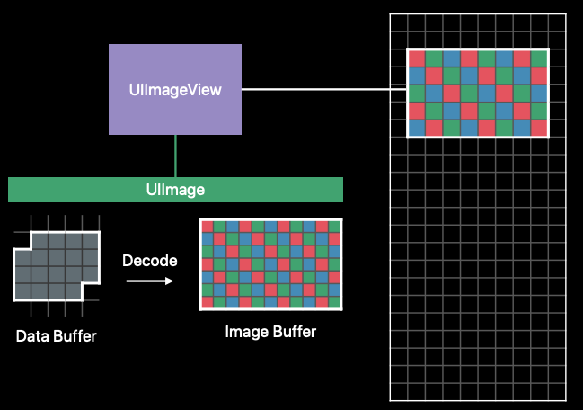

对于UIImage对象中的图片数据，其是被压缩后保存在data buffer中的，如果需要将这部分数据显示到图形界面上，其需要进行解压为 Image Buffer 并且写入Frame Buffer。这一过程不仅会消耗cpu资源，解压完成的图片会按照其原本的大小占用内存。


针对这一情况，我们可以使用Core Image 对图片进行预解压和向下采样。

```Swift
// Downsampling large images for display at smaller size
func downsample(imageAt imageURL: URL, to pointSize: CGSize, scale: CGFloat) -> UIImage {
 let imageSourceOptions = [kCGImageSourceShouldCache: false] as CFDictionary
 let imageSource = CGImageSourceCreateWithURL(imageURL as CFURL, imageSourceOptions)!

 let maxDimensionInPixels = max(pointSize.width, pointSize.height) * scale
 let downsampleOptions =
 [kCGImageSourceCreateThumbnailFromImageAlways: true,
 kCGImageSourceShouldCacheImmediately: true,
 kCGImageSourceCreateThumbnailWithTransform: true,
 kCGImageSourceThumbnailMaxPixelSize: maxDimensionInPixels] as CFDictionary

 let downsampledImage =
 CGImageSourceCreateThumbnailAtIndex(imageSource, 0, downsampleOptions)!
 return UIImage(cgImage: downsampledImage)
}
```

这一过程可以异步执行，对于UITableView或者UIcollectionView，在iOS 10之后，我们可以选用Prefetching相关的API异步预处理图片。

```Swift
// Avoiding thread explosion when doing asynchronous work
let serialQueue = DispatchQueue(label: "Decode queue")
//这里只使用一个串行队列来保证不滥用多线程
func collectionView(_ collectionView: UICollectionView,
 prefetchItemsAt indexPaths: [IndexPath]) {
 // Asynchronously decode and downsample every image we are about to show
 for indexPath in indexPaths {
 serialQueue.async {
 let downsampledImage = downsample(images[indexPath.row])
 DispatchQueue.main.async { self.update(at: indexPath, with: downsampledImage) }
 }
 }
}
```

此外，通过asset指定具体图片大小（这会在编译时提前解压图片并复制到 image buffer）比使用矢量图效率更高。

# Custom Drawing with UIKit

不推荐重写UIView 的`draw`来绘制位图，因为这样绘制的位图内存占用大小（Backing store）与当前的视图大小成正比。

不过**iOS12**对Backing store的大小进行了优化，现在它是一个动态的大小，这取决于开发者是否使用sRGB来绘制广域色彩内容。

这一特性会默认开启，不过在 **iOS10** 之后，开发者可以通过在`CALayerDelegate`（iOS 10）中的`layerWillDraw:`方法设置`contentsFormat`来关闭sRGB的支持，不过这在**iOS12**会自动关闭`Backing store`的大小优化。

如果我们需要手动离屏渲染图片，那么可以使用 `UIGraphicsImageRender`（iOS 10），与旧的`UIGraphicsBeginImageContext`不同的是，其支持渲染广色域的内容，其同样也在**iOS12**支持`Backing store`的动态大小优化，与`draw`同样，在**iOS12**以前也可以设置`UIGraphicsImageRenderFormat`中的`prefersExtendedRange`属性来设置是否支持绘制广色域的内容，所以在**iOS12**以后也需要取消相关设置以支持动态优化。