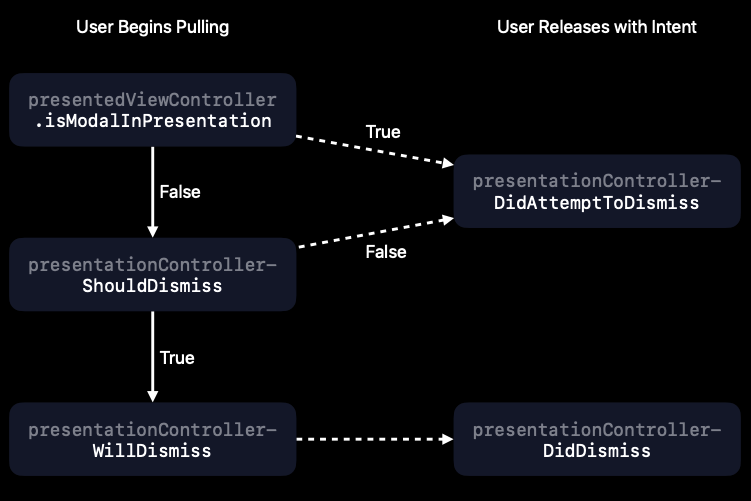

# Bars

iOS13以后使用`Launch Storyboards`代替了`Launch Image`。

添加了新类型`UINavigationBarAppearance`，用于配置`UINavigationBar`。

```Swift
let appearance = UINavigationBarAppearance()
appearance.configureWithOpaqueBackground()
appearance.titleTextAttributes = [.foregroundColor: myAppLabelColor]
appearance.largeTitleTextAttributes = [.foregroundColor: myAppLabelColor]
navigationBar.standardAppearance = appearance

//UINavigationItem也可以配置
let appearance = navigationBar.standardAppearance.copy()
// Configure whatever else you want
navigationItem.standardAppearance = appearance
```

除了`UINavigationBar`，针对`UIToolBar`和`UITabBar`也追加了与之相关的类型的`BarAppearance`。

不仅如此，通过`UIBarButtonItemAppearance`类型 ，可以设置`UIBarButtonItem`的外观，而`UITabBarItem`的外观则是用`UITabBarAppearance`设置。

`UINavigationBar`根据当前的sizeClass，可以被分为几种风格，通常的.standardAppearance，w为Regular，h为Compact的.compactAppearance，控制器内部存在ScrollView的.scrollEdgeAppearance。

# Presentations

**iOS13**的`UIModalPresentationStyle`添加了新类型`.automatic`，默认会是`.formSheet`风格，不过某些系统控制器会变为`.fullScreen`。

针对`.formSheet`的默认返回手势，我们可以使用相关代理方法进行控制。

```Swift
class EmailController: UIViewController, UIAdaptivePresentationControllerDelegate {
 func draftDidChange() {
   //这个值为真时，才会调用 presentationControllerDidAttemptToDismiss
 isModalInPresentation = draft.hasChanges
 }
 func presentationControllerDidAttemptToDismiss(_: UIPresentationController) {
 // Present action sheet
 }
}
```



# Search

开发者现在可以隐藏`UISearchBar`的`CancelButton` 和`ScopeBar`，且`UISearchTextField`现在是一个公共属性。

```Swift
func loadView() {
 let searchController = UISearchController(searchResultsController: /*...*/)
 // Don’t automatically show the cancel button or scope bar
 searchController.automaticallyShowsCancelButton = false
 searchController.automaticallyShowsScopeBar = false
 // Customize appearance of the search text field
 let searchField = searchController.searchBar.textField
 searchField.textColor = UIColor(named: "MyPinkColor")
 searchField.font = UIFont(name: "American Typewriter", size: 18)
 /* ... */
}
```

SearchResultController也可以一开始就显示。

```Swift
// Show the search results controller as soon as search is activated
 searchController.showsSearchResultsController = true
```

``UISearchTextField``现在新添加了`UISearchToken`。

```Swift
let selectedText = field.textIn(field.selectedTextRange) // "beach"
let token = UISearchToken(icon: nil, text: selectedText)
field.replaceTextualPo
```

UITableView and UICollectionView支持手势多选操作。

```Swift
optional func tableView(_ tableView: UITableView,
shouldBeginMultipleSelectionInteractionAtIndexPath indexPath: IndexPath) -> Bool
optional func tableView(_ tableView: UITableView,
didBeginMultipleSelectionInteractionAtIndexPath indexPath: IndexPath) 
```

# UIContextMenuInteraction